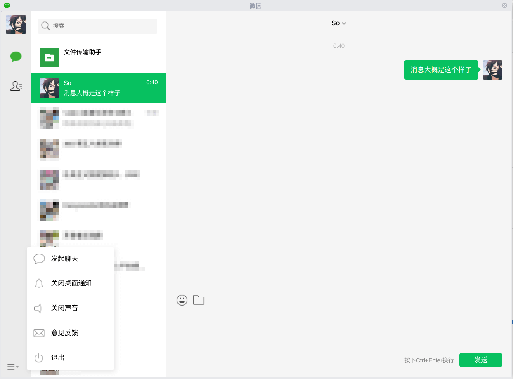

# 微信网页版

微信网页版增强 Monkey 脚本


## 特性

1. 使用`UOS`密钥强登，突破默认登录限制
2. 网页版界面调整，更贴合应用模式


## 应用模式

Chromium

```bash
chromium --app=https://wx.qq.com
```
Chrome

```bash
chrome --app=https://wx.qq.com
```


## 预览



